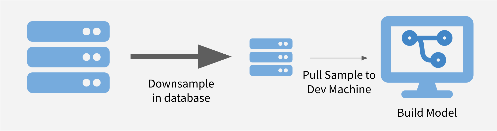
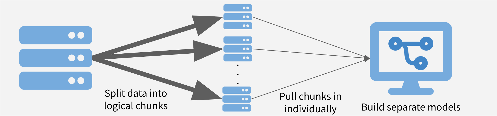
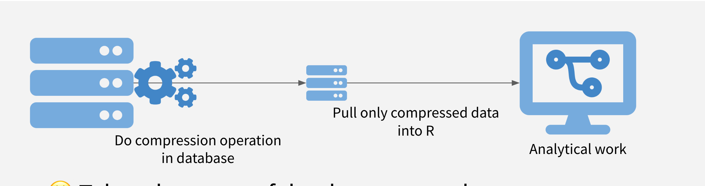

class: center

```{r setup, echo = FALSE, include = FALSE}
library(DBI)
library(dplyr)
library(dbplyr)
options(knitr.table.format = "html")
knitr::opts_chunk$set(fig.retina = 3, warning = FALSE, message = FALSE)
```


# Schedule
## 1. Strategies for Writing Queries
## 2. Mechanics of Querying Databases
##  - Connecting
## - Writing + Sending Queries
## 3. Deploying to RStudio Connect w/ Live Connections
---

# I. 3 Strategies for Efficient Queries
1. Sample and Model
2. Chunk and Pull
3. Push Compute to Data
--


.center[**You don't have to choose just 1! Combine as needed!**]
---

## Strategy 1: Sample and Model

.center[

]
--

😃 Use favorite R modeling package (`caret/parsnip/rsample`).

😃 Really good for iterating/prototyping.

☹️ Requires care for sampling and scaling. 

☹️ Not good for BI tasks.


---

## 2. Chunk and Pull
.center[

]

--
😃 Great when discrete chunks exist.

😃 Facilitates parallelization.

☹️ Can’t have interactions between chunks.

☹️ Eventually pull in all data.

---

## 3. Push Compute to Data
.center[

]
--

😃 Take advantage of database strengths.

😃 Get whole dataset, but move less data.

☹️ Operations might not be permitted in database.

☹️ Maybe your database is slow?

---

# II. The Mechanics

For all of our recommendations on using databases, as well as how-tos:

.center[[**db.rstudio.com**](https://db.rstudio.com)]

---

## Mechanics: Connecting

R Session -> R Package -> Database Driver -> Database

---

### R Packages: ☂️s

`DBI`: "front-end" for database connections w/ back-end options
- "`DBI-compliant`": Back-end that implements DBI API (plays nicely with RStudio)


`odbc`: generic option, works with Open Database Connectivity (ODBC) system 
- We provide [pro drivers](https://rstudio.com/products/drivers/) free of charge for popular databases.
- Microsoft SQL Server, Oracle, PostgreSQL, Amazon Redshift, Amazon Athena, Google BigQuery, Salesforce, Apache Cassandra, Apache Hive, Apache Impala, Teradata, MySQL, IBM Netezza, MongoDB
- Your database provider may provide an ODBC driver (e.g. SAP Hana).

---

### Connecting

**First Choice: DBI-Compliant R Package for your DB**

Combine R Package and Database Driver in 1!

```
DBI::dbConnect(RPostgres::postgres(), ...)
```
Options: `RPostgres`, `RMariaDB`, `RSQLite`, `bigrquery`
--

**Also Great: Driver + `odbc`/`DBI`**

Use `odbc::odbc` w/ system driver on system.
```
DBI::dbConnect(odbc::odbc(), driver = "Postgres", ...)
```
Requires driver `"Postgres"` be configured in `odbcinst.ini`.
---

## Connecting from the RStudio IDE

- Connections Pane - can use point-and-click, generates code
- Code - easier, can be used non-interactively (when deployed)

---

## Securing Credentials

#### Use a DSN 
#### Prompt for Password/Keyring
#### Config Package
#### Environment Variables
<br><br><br>

.small[See https://db.rstudio.com/best-practices/managing-credentials/ for more details.]

---

### Using a DSN
```{r}
con <- dbConnect(odbc::odbc(), "Postgres Prod", timeout = 10)
dbListTables(con)
dbDisconnect(con)
```

*Examine `/etc/odbc.ini` and `/etc/odbcinst.ini` to see how this works.*

---

### Prompting for Passwords
username `rstudio_prod`, pwd `prod_user` (weird order of dialogs...)
```{r, eval = FALSE}
# Note, not run for presentation, because will break in Rmd
con <- dbConnect(
  odbc::odbc(),
  Driver = "PostgreSQL",
  Server = "localhost",
  UID    = rstudioapi::askForPassword("Database user"),
  PWD    = rstudioapi::askForPassword("Database password"),
  Port = 5432,
  Database = "postgres"
)
dbDisconnect(con)
```

---

### Config Package
Checkout config file in `~/rstudio_workshops/config.yml`
```{r}
cfg <- config::get()
con <- dbConnect(
  odbc::odbc(),
  Driver = cfg$driver,
  Server = cfg$server,
  UID    = cfg$uid,
  PWD    = cfg$pwd,
  Port   = cfg$port,
  Database = cfg$database
)
dbListTables(con)
dbDisconnect(con)
```

---

### Environment Variables

```{r}
con <- dbConnect(
  odbc::odbc(),
  Driver = "PostgreSQL",
  Server = "localhost",
  UID    = Sys.getenv("db_uid"),
  PWD    = Sys.getenv("db_pass"),
  Port = 5432,
  Database = "postgres"
)
dbListTables(con)
dbDisconnect(con)
```
---

class: inverse

**Exercise**

_Connect to a database and Explore_

1. Click on the `Connections` tab

2. Click on the `New Connection` button

3. Click on one of the connections.

4. Click OK

5. Explore the `retail` schema in the IDE.

6. Click the disconnect button (red x).

7. Re-connect using code generated by `Connections` tab.

---

## Sending Queries

### SQL code chunks (or scripts)
### `dbGetQuery`
### dplyr

---

### SQL Code Chunks 1/2
.pull-left[
Include a SQL code chunk in RMarkdown.
<br><br>
#### Connect via R.
<br><br><br><br><br>
####Send SQL Query

`{sql, connection = con}`
]
.pull-right[
<br><br>
```{r}
con <- DBI::dbConnect(
  odbc::odbc(), 
  "Postgres Prod"
  )
```
<br>

```{sql, connection = con}
/* SQL Chunk */
SELECT * FROM retail.orders LIMIT 1;
```
]
---
### SQL Code Chunks 2/2

Add an `output.var` argument to read into R

`{sql, connection = con, output.var = "dat"}`

If same for all SQL chunks: `knitr::opts_chunk$set(connection = "con")`
.pull-left[
```{sql, connection = con, output.var = "dat"}
/* SQL Chunk */
SELECT * FROM retail.orders LIMIT 2;
```

```{r}
# r chunk
dat
```
]

.pull-right[

Can also do entire SQL scripts.
]
---

### `dbGetQuery`

Get a list of tables
```{r}
library(DBI)
DBI::dbListTables(con)
```

### Send a query
```{r}
(dat <- DBI::dbGetQuery(con, "SELECT * FROM retail.date LIMIT 4;"))
```

---

## dplyr + Databases = dbplyr

### Connect to a Table
```{r}
cust <- dplyr::tbl(con, dbplyr::in_schema("retail", "customer"))
head(cust, 2)
```
--

#### Question
What is cust? What will I get from `names(cust)`?

1. `customer_id, customer_name, customer_phone, etc`
2. Something weird 👽
---
# 👽👽👽👽👽👽👽

```{r}
names(cust)
```

--


.pull-left[
### Lazy Eval
dplyr doesn't *do* anything for as long as possible. So cust isn't
an actual table, it's a reference to a table in the SQL server.

Let's dig in.
]
.pull-right[
### Show Query
SQL statement that actually runs when we ran `cust` as a command
```{r}
cust %>%
  dplyr::show_query()
```
]
---

### Under the hood
Because it's just a reference to a SQL query, I can *keep adding*!

.pull-left[
```{r}
q <- cust %>%
  filter(customer_lon < -122.4463) %>%
  select(customer_name, customer_phone) %>%
  head(2)
```
]
--
.pull-right[
```{r}
q

show_query(q)
```
]

---
### `collect` for an R `data.frame`
.pull-left[
```{r}
q
names(q)
```
]
.pull-right[
```{r}
(q <- collect(q))
names(q)
```
]

*Hint:* Look at the first two rows of the un-`collect`ed data.
---

### Un-Translated Functions
.pull-left[
What happens if I put in an R command w/ no SQL equivalent?
```{r}
# Not running because it's an error (and not even an R error!)
cust %>%
  mutate(today = Sys.time()) %>%
  show_query()
```
It just sends the command along - "maybe it's a SQL command?"
]

---
### Un-Translated Functions: Option 1/2
#### Translate Before Sending

Prefix w/ `!!` (bang-bang)
.pull-left[
```{r}
cust %>%
  mutate(today = !!Sys.Date()) %>%
  select(customer_id, today) %>%
  head(3) %>%
  show_query()
```
]
.pull-right[
```{r}
cust %>%
  mutate(today = !!Sys.Date()) %>%
  select(customer_id, today) %>%
  head(3)
```
]
---

#### Use Built In Functions
Use built-in SQL function `now()` for Postgres
.pull-left[
```{r}
q <- cust %>%
  transmute(today = now())

# Note:
tryCatch(now(), error = function(e) e)
```
]
.pull-right[
```{r}
# But
head(q, 3)

q  %>%
  show_query()
```
] 

---
* THESE WILL ALL MOVE TO THE WORKBOOK *
### Basic aggregation

How many records are in the **product** table?

--

```{r}
prods <- tbl(con, in_schema("retail", "product"))  

prods %>%
  tally()
```

---
### Controlling Returns
What is this object?
```{r}
n_prods <- prods %>% tally()
```

--

```{r}
names(n_prods)
```

How do I get a real R object?

--

```{r}
n_prods <- collect(n_prods)
n_prods
names(n_prods)
```

---

### Basic aggregation 2
What is the average customer longitude?  Average length of customer names?
--

```{r}
cust %>%
  summarise(
    avg_cust_lon = mean(customer_lon, na.rm = TRUE),
    avg_cust_name = mean(str_length(customer_name), na.rm = TRUE)
  )
```

How many records are in the **orders** table?
```{r}
```

What's the most recent date in the **date** table?
```{r}
```

What is the SQL statement sent to find the date in the table above?
```{r}
```


# III. Deployment to RStudio Connect

Register RStudio Connect Server

- Deploy to: `[http://URL...amazonaws.com]/rsconnect`
- Username: `john_deere_user`
- Password: `john_deere_pass`
- Email: whatever you want (fake ok)

---

For the shiny app, will need to add environment variables. 


---
# Appendix
- These slides were created with `rmarkdown` and `xaringan`. To learn more about the `xaringan` package, check out Alision's slides from her rstudio::conf 2019 workshop https://arm.rbind.io/slides/xaringan.html
