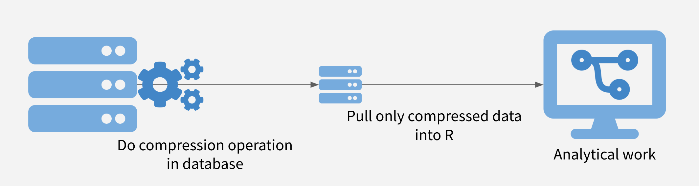

```{r setup, echo = FALSE, include = FALSE}
library(DBI)
library(dplyr)
```


# Schedule
1. Strategies for Writing Queries
2. Mechanics of Querying Databases
- Connecting
- Writing + Sending Queries
3. Deploying to RStudio Connect w/ Live Connections

---

# I. 3 Strategies for Efficient Queries
1. Sample and Model
2. Chunk and Pull
3. Push Compute to Data
--


(Not exclusive!)
---

## Strategy 1: Sample and Model
.center[

]
--

😃 Use favorite R modeling package (`caret/parsnip/rsample`).

😃 Really good for iterating/prototyping.

☹️ Requires care for sampling and scaling. 

☹️ Not good for BI tasks.


---

## 2. Chunk and Pull
.center[

]

--
😃 Great when discrete chunks exist.

😃 Facilitates parallelization.

☹️ Can’t have interactions between chunks.

☹️ Eventually pull in all data.

---

## 3. Push Compute to Data
.center[

]
--

😃 Take advantage of database strengths.

😃 Get whole dataset, but move less data.

☹️ Operations might not be permitted in database.

☹️ Maybe your database is slow?

---

# II. The Mechanics

db.rstudio.com

### R Packages
- `DBI`: "front-end" for database connections w/ back-end options
- `RPostgres`
- `RMariaDB`
- `RSQLite`
- `bigrquery`
- `odbc` <- generic option, works with Open Database Connectivity (ODBC) system (Pro Drivers)


Process: 

`Write Code` -> `Translate code` -> `Package sends to database` -> `Response`

---

## Connection Methods

https://db.rstudio.com/best-practices/managing-credentials/

- Connections Pane
- Code

--

### Using a DSN
```{r}
con <- dbConnect(odbc::odbc(), "Postgres Prod", timeout = 10)
dbDisconnect(con)
```

*Examine `/etc/odbc.ini` and `/etc/odbcinst.ini`*

--

### Prompting for Passwords
username `rstudio_prod`, pwd `prod_user` (weird order of dialogs...)
```{r, eval = FALSE}
con <- dbConnect(
  odbc::odbc(),
  Driver = "PostgreSQL",
  Server = "localhost",
  UID    = rstudioapi::askForPassword("Database user"),
  PWD    = rstudioapi::askForPassword("Database password"),
  Port = 5432,
  Database = "postgres"
)
dbDisconnect(con)
```

--

### Config Package
```{r}
cfg <- config::get(file = here::here("01_databases/slides/config.yml"))
con <- dbConnect(odbc::odbc(),
                 Driver = cfg$driver,
                 Server = cfg$server,
                 UID    = cfg$uid,
                 PWD    = cfg$pwd,
                 Port   = cfg$port,
                 Database = cfg$database
)
```

--

### Environment Variables

`Sys.setenv(var = "val")`

`~/.Rprofile`

Project `.Rprofile`

---

**Exercise**

_Connect to a database and Explore_

1. Click on the `Connections` tab

2. Click on the `New Connection` button

3. Select `Postgres Prod`

4. Click OK

5. Explore the `retail` schema in the IDE.

6. Click the disconnect button (red x).

7. Re-connect using code generated by `Connections` tab.

---

## Interacting with Databases

- SQL code chunks (or scripts)
- `dbGetQuery`
- dplyr

---
### SQL Code Chunks
Include a SQL code chunk in an RMarkdown doc.

https://bookdown.org/yihui/rmarkdown/language-engines.html#sql

`{sql, connection = con}`

```{sql, connection = con}
/* SQL Chunk */
SELECT * FROM retail.orders LIMIT 10;
```

---
Add an `output.var` argument to read into R

`{sql, connection = con, output.var = "dat"}`

```{sql, connection = con, output.var = "dat"}
/* SQL Chunk */
SELECT * FROM retail.orders LIMIT 10;
```

```{r}
# r chunk
dat
```

If same for all SQL chunks: `knitr::opts_chunk$set(connection = "con")`

Can also do entire scripts.
---

### `dbGetQuery`

Get a list of tables
```{r}
library(DBI)
DBI::dbListTables(con)
```

### Send a query
```{r}
dat <- DBI::dbGetQuery(con, "SELECT * FROM retail.date LIMIT 10;")
dat
```


## dplyr + Databases = dbplyr

### Connect to a Table
```{r, dplyr}
library(dplyr)
library(dbplyr)
library(DBI)
```

```{r}
cust <- tbl(con, in_schema("retail", "customer"))

cust
```

*Question:* What is cust? What will I get from `names(cust)`?

--

```{r}
names(df)
```

🤯
---

### Under the hood

SQL statement that actually runs when we ran `cust` as a command
```{r}
cust %>%
  dplyr::show_query()
```

--

Use normal dplyr verbs to build tables
```{r}
q <- cust %>%
  filter(customer_lon < -122.4463) %>%
  select(customer_name, customer_phone)

q

show_query(q)
```

### Un-Translated Functions

What happens if I put in an R command w/ no SQL component?
```{r}
cust %>%
  mutate(today = Sys.time()) %>%
  show_query()
```
--

Use PostgreSQL's native commands, in this case `now()`
```{r}
q <- cust %>%
  transmute(today = now())

q

q  %>%
  show_query()
```

--


```{r}
cust %>%
  mutate(today = now()) %>%
  select(today) %>%
  head()
```

###  Evaluate Before Sending

Preview how `Sys.time()` is translated
```{r}
cust %>%
  mutate(today = Sys.time()) %>%
  show_query()
```

But when prefixed w/ bang-bang (`!!`)
```{r}
cust %>%
  mutate(today = !!Sys.time()) %>%
  show_query()
```

### Basic aggregation

How many records are in the **product** table?

--

```{r}
prods <- tbl(con, in_schema("retail", "product"))  

prods %>%
  tally()
```

---
### Controlling Returns
What is this object?
```{r}
n_prods <- prods %>% tally()
```

--

```{r}
names(n_prods)
```

How do I get a real R object?

--

```{r}
n_prods <- collect(n_prods)
n_prods
names(n_prods)
```

---

### Basic aggregation 2
What is the average customer longitude?  Average length of customer names?
--

```{r}
cust %>%
  summarise(
    avg_cust_lon = mean(customer_lon, na.rm = TRUE),
    avg_cust_name = mean(str_length(customer_name), na.rm = TRUE)
  )
```

How many records are in the **orders** table?
```{r}
```

What's the most recent date in the **date** table?
```{r}
```

What is the SQL statement sent to find the date in the table above?
```{r}
```


# III. Deployment to RStudio Connect

Register RStudio Connect Server

- Deploy to: `[http://URL...amazonaws.com]/rsconnect`
- Username: `john_deere_user`
- Password: `john_deere_pass`
- Email: whatever you want (fake ok)

---

For the shiny app, will need to add environment variables. 


---
# Appendix
- These slides were created with `rmarkdown` and `xaringan`. To learn more about the `xaringan` package, check out Alision's slides from her rstudio::conf 2019 workshop https://arm.rbind.io/slides/xaringan.html
  