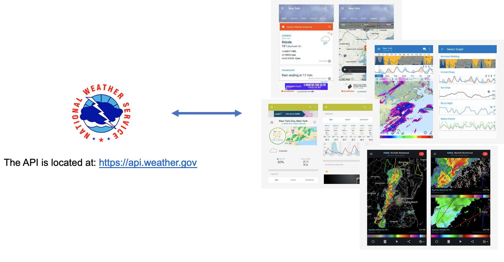
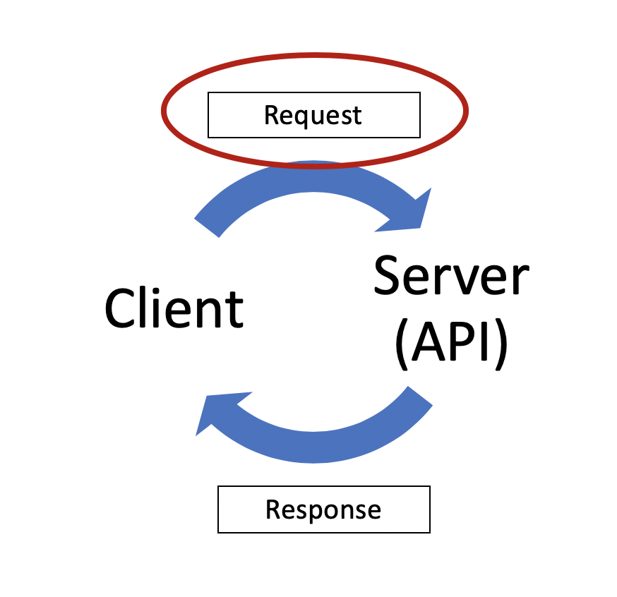
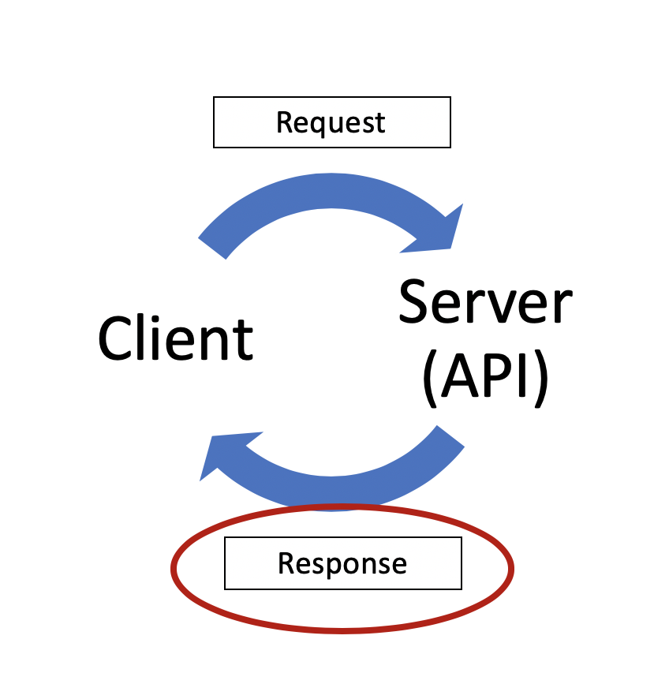
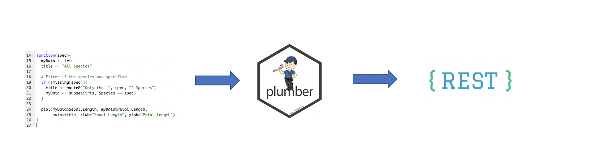
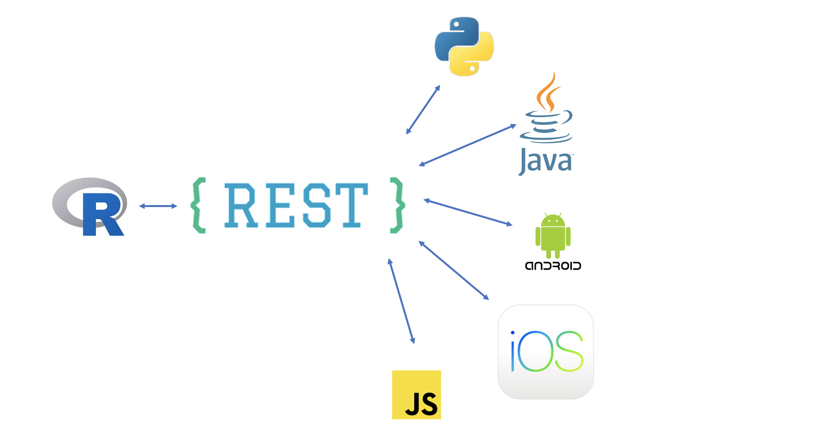
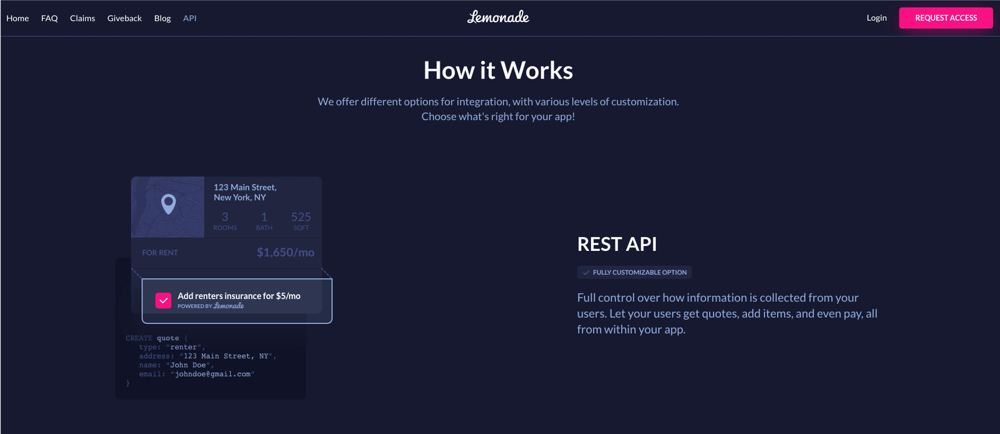
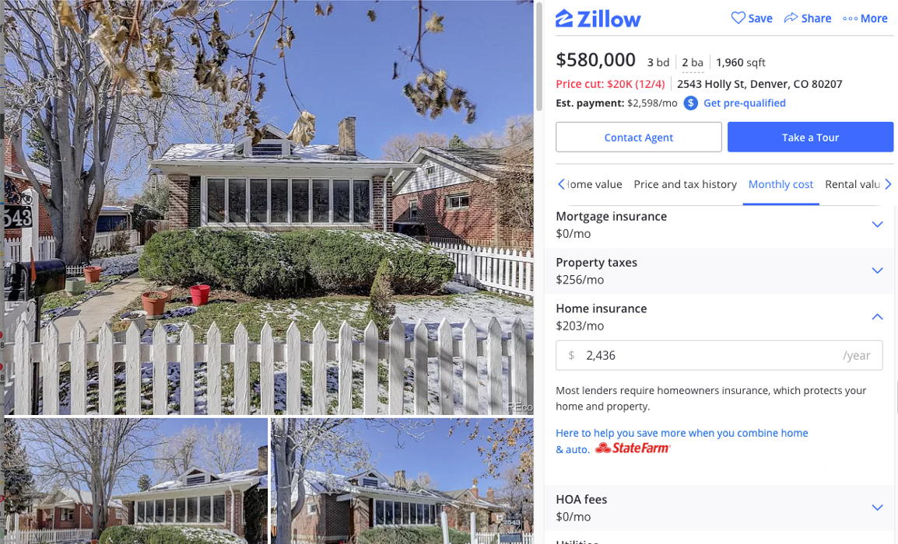
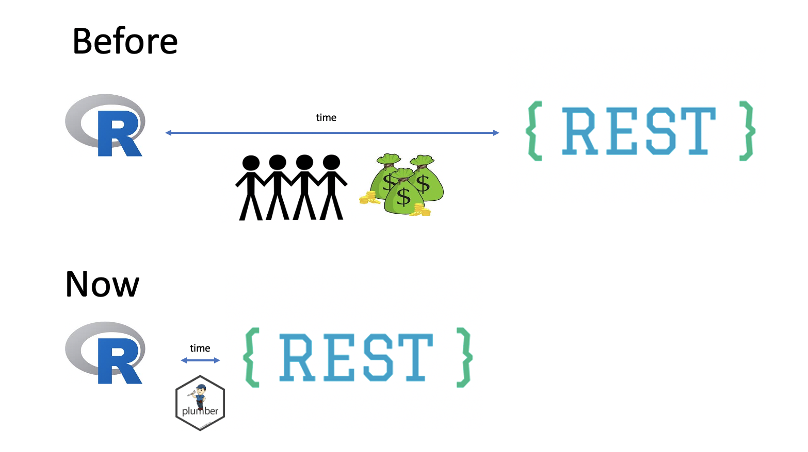

# APIs

- Stands for **Application Programming Interface**
- APIs are used to **transfer information** between applications/programs
- HTTP APIs have become the **predominant language** by which software communicates

???
"APIs are how weather forecast data is shared from a reputable source like the National Weather Service to hundreds of software apps that specialize in its presentation." Brenda Jin

---
# You call APIs by making "requests"  

.right-column[
**Requests are made up of:**
- a start line (mandatory)  
  - HTTP version (e.g. HTTP/1.1)
  - Method (e.g. GET, POST, PUT, DELETE)
  - API folder path
  - parameters
- headers (optional)
  - host name
  - token
- body (optional)

**How to make API calls in R:**  
`httr::GET(url, query = <list of query parameters>, ...)`
]

.left-column[

]

???
GET http://www.w3.org/pub/WWW/TheProject.html HTTP/1.1

https:://api-endpoint.org/api/rest_v1/resource_name?query1=value1&query2=value2

---
# ... and the API responds with a "response"  

.left-column[

]

.right-column[
API responses will most often be JSON or XML, standard formats for transferring information over the web.  

R, like other programming languages, has some great tooling for working with these standard data types.(e.g. `jsonlite::fromJSON(content(response, as = "text")))`
]

---
# Exercise 2.1: make an API call (with your web browser)  

- Open your web browser

- Right-click and select "Inspect"

- Go the to "Network tab"
- Try any of these from your web browser:
  - Execute a google search
  - Navigate to the URL https://wikimedia.org/api/rest_v1/metrics/pageviews/per-article/en.wikipedia/all-access/all-agents/Barack_Obama/monthly/2018010100/2018123100
  

Are you able to find the API request (URL, Method, Headers, ect.) and response (headers, response body, etc.) ?

???
the web browser made the request for you
to-do: verify inspect process w/ other web browsers. Increase font size + spacing

---
# Directory vs. parameter based APIs  

- https:://api-endpoint.org/api/rest_v1/resource_name?query1=value1&query2=value2

- https:://api-endpoint.org/api/rest_v1/rescource_name/query1/value1

???
The URL, also referred to as the endpoint, is how you access the API resource you’re looking for. In addition to the path to the API resource, you may also tack on some query parameters which allow you to modify your request for different key-value pairs. Query parameters are added at the end of your URL like so: https:://api-endpoint.org/api/rest_v1/resource_name?query1=value1&query2=value2.
Or the API may use Path Variables instead, in which case your HTTP request would look something like this: https::/api-endpoint.org/api/rest_v1/rescource_name/query1/value1

---
# How to make an API call in R  

- Does an API client already exist?

- If yes, use it!

- If no, then use the `httr` package

???
Q: do other packages exist for making API calls?

  

---
# Plumber Package
Convert your R code into a REST API!  

---
# APIs provide a common interface other software can interact with

???
APIs give these systems a common language via a common interface
"IT org not set up to incorporate R models" - common challenge

---
# Insurance data science teams are starting build a lot more APIs (with R)!
Some examples of what they are building include:

- APIs for 3rd parties like brokers & partners
- Using APIs as a way to deploy models like:
  - Fraud detection 
  - Pricing / Rating
  - Expected Claims Cost

???
"APIs can help make it easy for partners to do business with you. Providing APIs to an ecosystem of related services partners is an approach that is well-suited for generating new revenue streams." - [IBM Whitepaper\: Identifying API use cases\:
Property and casualty insurance](https://www.ibm.com/downloads/cas/XNMBM5BL)

---
# Lemonade Insurance API Example  

---
# Zillow Insurance API Example  

---
# Plumber makes it easier, faster, and cheaper  

---
# Demo time!  
Follow these 5 steps to create your first Plumber API:
  1. write an R function
  2. install plumber
  3. add special comments
  4. test it / try it out
  5. deploy it

---
# Plumber docs, examples, and videos  
- Slides & example scripts from today's screenshare: https://github.com/hdykiel/plumber-demo
- Plumber website: https://www.rplumber.io/
- James' [rstudio::conf 2019 Plumber talk](https://resources.rstudio.com/rstudio-conf-2019/democratizing-r-with-plumber-apis) (2020 presentation available soon!)
- e-mail me at Hadrien@rstudio.com with any questions

---
# Please take the survey:

https://forms.gle/2M14gSedF9khyzTE7

---
# Appendix    
- These slides were created with `rmarkdown` and `xaringan`. To learn more about the `xaringan` package, check out Alision's slides from her rstudio::conf 2019 workshop https://arm.rbind.io/slides/xaringan.html
