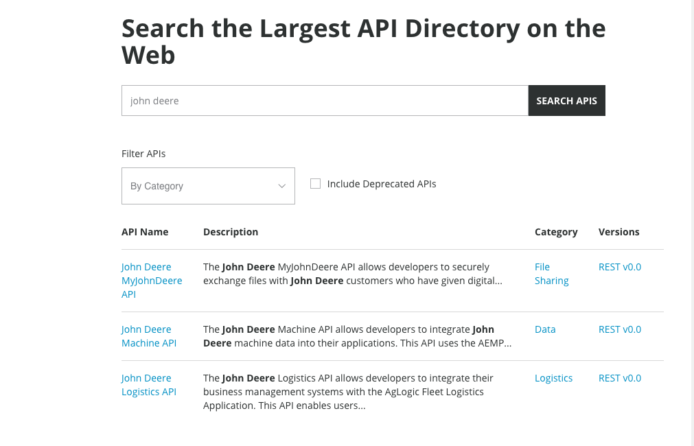

# What is an API?

- Stands for **Application Programming Interface**
- APIs are used to **transfer information** between applications/programs
- HTTP APIs have become the **predominant language** by which software communicates


???
"APIs are how weather forecast data is shared from a reputable source like the National Weather Service to hundreds of software apps that specialize in its presentation." Brenda Jin

---
# APIs provide a common interface other software can interact with


???
APIs give these systems a common language via a common interface
"IT org not set up to incorporate R models" - common challenge

---
# Where to discover new web APIs  


Programmable Web's [API Directory](https://www.programmableweb.com/category/all/apis) is "where developers can search for APIs to include in their next software development project"

---
# John Deere APIs  



---
# Where to discover new web APIs  


---
class: center, middle

# First, let's make some API calls  


---
# You call APIs by making "requests"  

.right-column[
**Requests are made up of:**
- a start line (mandatory)  
  - HTTP version (e.g. HTTP/1.1)
  - Method (e.g. GET, POST, PUT, DELETE)
  - API folder path
  - parameters
- headers (optional)
  - host name
  - token
- body (optional)

**How to make API calls in R:**  
`httr::GET(url, query = <list of query parameters>, ...)`
]

.left-column[

]

???
GET http://www.w3.org/pub/WWW/TheProject.html HTTP/1.1

https:://api-endpoint.org/api/rest_v1/resource_name?query1=value1&query2=value2

"Web developers, or webmasters, rarely craft these textual HTTP messages themselves: software, a Web browser, proxy, or Web server, perform this action." (https://developer.mozilla.org/en-US/docs/Web/HTTP/Messages)


---
# ... and the API responds with a "response"  

.left-column[

]


.right-column[
API responses will most often be JSON or XML, standard formats for transferring information over the web.  

R, like other programming languages, has some great tooling for working with these standard data types.(e.g. `jsonlite::fromJSON(content(response, as = "text")))`
]


---
# Exercise 2.1: make an API call with your web browser (4 mins)  

- Open your web browser

- Right-click and select "Inspect"

- Go the to "Network tab"
- Try any of these from your web browser:
  - Execute a google search
  - Navigate to the URL https://wikimedia.org/api/rest_v1/metrics/pageviews/per-article/en.wikipedia/all-access/all-agents/Barack_Obama/monthly/2018010100/2018123100
  

Are you able to find the API request (URL, Method, Headers, ect.) and response (headers, response body, etc.) ?

???
the web browser made the request for you
to-do: verify inspect process w/ other web browsers. Increase font size + spacing


---
# Directory vs. parameter based APIs  

- https:://api-endpoint.org/api/rest_v1/resource_name?query1=value1&query2=value2

- https:://api-endpoint.org/api/rest_v1/rescource_name/query1/value1

???
The URL, also referred to as the endpoint, is how you access the API resource you’re looking for. In addition to the path to the API resource, you may also tack on some query parameters which allow you to modify your request for different key-value pairs. Query parameters are added at the end of your URL like so: https:://api-endpoint.org/api/rest_v1/resource_name?query1=value1&query2=value2.
Or the API may use Path Variables instead, in which case your HTTP request would look something like this: https::/api-endpoint.org/api/rest_v1/rescource_name/query1/value1

---
# Dealing with large responses  

Pagination.


---
# How to make an API call in R  

- Does an API client already exist?

- If yes, use it!

- If no, then use the `httr` package

???
Q: do other packages exist for making API calls?


---
# Example of an API client


Depending on which API you wish to work with, an R package might already have been created for it!

--

**API Client Example**  

`pageviews` package:  An API Client for Wikipedia Traffic Data

--
```{r}
library(pageviews)
article_pageviews(article = "Barack_Obama")
```

???

API clients are native interfaces to APIs that hide API complexity and let you read data in as R data objects.
API clients are software libraries in various languages, including R, that make it possible for programmers to interact with the API without ever having to care about how it is structured, or do the heavy lifting of cleaning up the data.

---
class: center, middle

# No API client? No problem!

---
# `httr` makes http easy


`?httr`  

--

**Description**  
httr is organised around the six most common http verbs: GET(), PATCH(), POST(), HEAD(), PUT(), and DELETE().  

--

**Details**  
Each request returns a response() object which provides easy access to status code, cookies, headers, timings, and other useful info. The content of the request is available as a raw vector (content()), character vector (text_content()), or parsed into an R object (parsed_content()), currently for html, xml, json, png and jpeg).  

--

Requests can be modified by various config options like set_cookies(), add_headers(), authenticate(), use_proxy(), verbose(), and timeout()


---
# Exercise 1: make an API call with `httr::GET()`

- Make a request by calling `httr::GET()` with the URL http://httpbin.org/get

- print the response object

- pull out important parts of the response with helper functions like `status_code()` and `headers()`

- access the body of the request using `content()`

???
"HTTP methods like GET, POST, UPDATE, and DELETE inform the server about the action to be performed. Different HTTP methods invoked on the same URL provide different functionality..."

"Use GET for reading resources.  GET requests never, ever change the state of the resource. They have no side effect; the GET method has a read-only semantic. GET is idempotent. Consequently, you can cache the calls perfectly."

"httpbin.org throughout this introduction. It accepts many types of http request and returns json that describes the data that it received. This makes it easy to see what httr is doing." - httr vignette

"GET() is used by your browser when requesting a page, and POST() is (usually) used when submitting a form to a server. " - httr vignette

---
# Exercise 2: access the body of the response  

To do: add `content()` example (and maybe `fromJSON`)

???
"These are convenient for interactive usage, but if you’re writing an API wrapper, it’s best to parse the text or raw content yourself and check it is as you expect. See the API wrappers vignette for more details." - vignette


---
# What you've learned so far  

- what APIs are and how they work  
- how to use APIs as data sources with...
  - an API client
  - the `httr` package

---
class: center, middle

# Time to build your own API!

---
# What is Plumber?
Convert your R code into a REST API!  


---
# Data science teams are starting build a lot more APIs (with R)!
Some examples of what they are building include:

- APIs for 3rd parties like partners & dealerships

- Using APIs as a way to deploy models like:
  - Fraud detection 
  - Pricing / Rating
  - Expected Claims Cost

???
"APIs can help make it easy for partners to do business with you. Providing APIs to an ecosystem of related services partners is an approach that is well-suited for generating new revenue streams." - [IBM Whitepaper\: Identifying API use cases\:
Property and casualty insurance](https://www.ibm.com/downloads/cas/XNMBM5BL)

---
#   API Example 1


---
# API Example 2


---
# Plumber makes it easier, faster, and cheaper  


---
# Exercise (4 mins)
In groups of 2 or 3, brainstorm some of the ways you could use plumber. Think of any future, current, or past project you've worked on.

---
# Practice time!  
Follow these 3 steps to create your first Plumber API:
  1. write an R function
  2. add special comments
  3. test it / try it out

  
  
---
# Step 1: write an R function

```{r}
function(x, y) {
  as.numeric(x) + as.numeric(y)
}
```

Save it as `plumber.R`, the conventional name for a plumber API file.

---
# Step 2: add special comments

```{r}
library(plumber)

#* @apiTitle My First Plumber API

#* My API endpoint description: add 2 numbers together!
#* @param x Value 1
#* @param y Value 2
#* @get /echo
function(x, y) {
  as.numeric(x) + as.numeric(y)
}
```

???
"Unless instructed otherwise, Plumber will attempt to render whatever your endpoint function returns as JSON. However, you can specify alternative “serializers” which instruct Plumber to render the output as some other format such as HTML (@html), PNG (@png), or JPEG (@jpeg)."(Plumber Docs)(https://www.rplumber.io/docs/quickstart.html#specifying-the-inputs)

---
#Step 3: try it out (using Swagger)  

Click on "Run API" button or `plumb(file='plumber.R')$run()`

???
"The Swagger UI is an open source project to visually render documentation for an API defined with the OpenAPI (Swagger) Specification. Swagger UI lets you visualize and interact with the API’s resources " - [swagger.io](https://swagger.io/tools/swagger-ui/download/)

---
# Exercise: create your first Plumber API (7 minutes)  

1) write an R function and save the file as `plumber.R`  

2) add special comments  

3) click "run API" button and explore your API via the Swagger GUI

Stuck? Check out www.rplumber.io/docs


---
# Response types  

By default, Plumber serializes objects into JSON via the jsonlite R package. However, there are a variety of other serializers that are built in to the package.

--

Annotation 	Content Type	Description/References
@json	application/json	jsonlite::toJSON()
@html	text/html; charset=utf-8	Passes response through without any additional serialization
@jpeg	image/jpeg	jpeg()
@png	image/png	png()
@serializer htmlwidget	text/html; charset=utf-8	htmlwidgets::saveWidget()
@serializer unboxedJSON	application/json	jsonlite::toJSON(unboxed=TRUE)

---
# Exercise: return an image


---
# Hosting
---
# Resources to learn more about Plumber
- Slides & example scripts from today's screenshare: https://github.com/hdykiel/workshop_february_2020
- Plumber website: https://www.rplumber.io/
- James' [rstudio::conf 2019 Plumber talk](https://resources.rstudio.com/rstudio-conf-2019/democratizing-r-with-plumber-apis) (2020 presentation available soon!)
- e-mail Katie.Masiello or Hadrien@rstudio.com with any questions

---
class: center, middle

# Bonus

---
# Case Study #1   
A Shiny application has some long running queries (> 1 minute). Application users have to wait extended periods for the application to load, especially when multiple users are accessing the app simultaneously.

- as the Shiny dev, what can you do to indentify performance bottlenecks?
- what is one way that plumber can help?

???
https://kellobri.github.io/shiny-prod-book/alternatives-to-shiny.html


---
# Appendix    
- These slides were created with `rmarkdown` and `xaringan`. To learn more about the `xaringan` package, check out Alision's slides from her rstudio::conf 2019 workshop https://arm.rbind.io/slides/xaringan.html

- Please take the survey: https://forms.gle/2M14gSedF9khyzTE7

