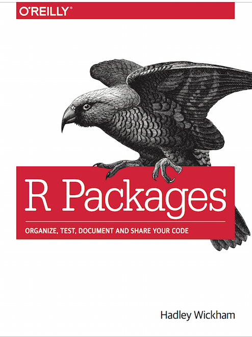

```{r setup}
library(ggplot2)
library(magrittr)
```


# Building Packages in R

.left-column[

]

.right-column[
For more on building packages: http://r-pkgs.had.co.nz/ (google: `R packages`)

If you want **A LOT** of detail: https://cran.r-project.org/doc/manuals/R-exts.html#Creating-R-packages
]

---

# Building R Packages
.pull-left[
### What We'll Cover
- Why write an R package?
- General Structure of R Packages
- Writing Code and Documentation
- Writing Tests
- Installing/Distributing Private Packages
]

--

.pull-right[
### What We Won't
- Metadata Files (`DESCRIPTION`)
- Versioning/Release Strategies
- Inclusions: data, other code
- Vignettes
]

---

# Why Write an R Package?
1. Share code with others
2. Share code with yourself
3. Make it easy to find function documentation
4. Disentangle dependencies

Some References:

[R Bnb](https://medium.com/airbnb-engineering/using-r-packages-and-education-to-scale-data-science-at-airbnb-906faa58e12d)

[Etsy](https://hilaryparker.com/2014/04/29/writing-an-r-package-from-scratch/)

---
# What should go in an (internal) R Package?
.left-column[ 

**Data Access functions**

]

.right-column[
```
db <- DBI::dbConnect(
  odbc::odbc(), 
  Driver = "postgresql", 
  Server = "prod.db.jd_db.com", 
  Port = "5432", 
  Database = "postgres", 
  UID = "alex", 
  PWD = .rs.askForSecret("postgresql 5396", "Password", "Database password:"), 
  BoolsAsChar = "")
```
vs 
```
db <- jd_con("prod")
```

]

---

# What should go in an (internal) R Package?
- Reference Data Sets (or deploy to RStudio Connect)
- Standard Plotting Functions
- Special Analytical Functions
- Report Templates

--
.center[


**Talk with a neighbor!**


]

---

# R Package Structure

Let's make one and explore:

**Option 1:** `devtools::create()`

**Option 2:** In the RStudio IDE

--

Things you need to edit:
- `R/`: This is where R code goes.
  - 1 < `n_files` < `n_functions`
- `DESCRIPTION`: Package Metadata

---

# Writing Code and Documentation 

.left-column[
These two go together.
]

--

.right-column[
R documentation is stored as `.Rd` files in the `man/`<sup>1</sup> directory.

It looks like this
```
\name{add}
\alias{add}
\title{Add together two numbers}
\usage{
add(x, y)
}
\arguments{
  \item{x}{A number}

  \item{y}{A number}
}
...
```
]

.footnote[
(1) Short for manual.
]
---

class: center
# `r emo::ji("face_vomiting")`

---

# Writing Code and Documentation: Easy Mode

With the [Roxygen2](https://cran.r-project.org/web/packages/roxygen2/vignettes/roxygen2.html)<sup>1</sup> package:

1. You write some specially-formatted comments.
2. R writes the `.Rd` + `NAMESPACE` files for you.
3. R displays `.Rd` as comments when you type `?command`

--

```
#' Add together two numbers
#'
#' @param x A number
#' @param y A number
#' @return The sum of \code{x} and \code{y}
#' @examples
#' add(1, 1)
#' add(10, 1)
add <- function(x, y) {
  x + y
}
```
]

.footnote[
(1) Dunno what happened to Roxygen1...
]

---

# Let's create a Function

Let's actually write the add function.

--

1. Create a regular `.R` file in `R/`
2. Write an R function
3. `Code` > ` Insert Roxygen Skeleton`
 - Fill Out
4. `devtools::document()`

---
# What's in Roxygen?

Note special comment characters `#'`

First line is title, can include more description in second paragraph.

- `@param` [var] parameter(s), must be in function signature (multiple w/ commas, no spaces)
  - recommend mentioning required type, and defaults
- `@return` what does it return, prose?
- `@export` ...we'll get to it...
- `@examples` examples of the function, important! Can run in line.

--

## Helpful Bonus Tags
- `@inherit source_fn` - inherit all docs from `source_fn`
- `@inherit source_fn return details` - inherit named docs from `source_fn`
- `@inheritParams source_fn` - inherit parameter documentation from `source_fn`

---

*Exercise:*
- Write `times_two`
  - `times_two(x) = x * 2`
- Document with `Roxygen`
- Run `devtools::document()`
- Try `?times_two`

---

# Making Functions Available

If `@export` used in Roxygen skeleton - normal function:
- Available using `myPkg::fun` or after `library(myPkg)`

If not, available only to other functions in the package, or by calling `myPkg:::fun`.

--

* Check `NAMESPACE` of your package.

---

# Using Internal Functions

*Exercise:*

1. Write a `times` function, not exported
  - `times(x, y) = x * y`
2. Refactor `times_two` to use `times`
3. Write a `times_three` function using `times`
  - `times_three(x) = x * 3`
  - Use `inerit` to write the documentation
4. Run `devtools::document()`
5. Check out `?times_three` and `NAMESPACE` (Where's `times`?)

---


# Using Packages in a Package?

Let's Create `2x_col(df, col)`

Hint: Function body
```
dplyr::mutate(df, times_2 = times_two({{col}}))
```
--

But what if they don't have dplyr?

`usethis::use_package`
--
.footnote[
Also `usethis::use_pipe`
]
---

# Writing Tests

- Fewer Bugs -- describe what you mean
- Better code structure
- Easier Restarts
- Won't break when you update

--

## Levels of Testing
- Level 1: Run Examples 
  - Example-Driven Development
- Level 2: Use a testing framework (`testthat`)
- Level 3: Adopt a CI automated testing framework (not covered today)

--- 

# Using Testthat
https://testthat.r-lib.org/
- `usethis::use_testthat`: set up testing framework
- `usethis::use_test`: write a specific test
- `devtools::test` - run tests
- `testthat::expect_...`
  - Different equalities `?expect_equal`
  
Try:
```
l <- list(a = 1:5)
class(l) <- "special_list"
expect_equal(l, list(a = 1:5))
expect_equivalent(l, list(a = 1:5))
```
---

# Installing/Distributing Packages

Push it to git

- Serve via RSPM (build on commits or tags), install with `install.packages`
- Serve straight from git, install with `remotes::install_git`/`remotes::install_github`

OR

- Send people source `remotes::install_local` `r emo::ji("face_vomiting")`

---
# Appendix    
- These slides were created with `rmarkdown` and `xaringan`. To learn more about the `xaringan` package, check out Alision's slides from her rstudio::conf 2019 workshop https://arm.rbind.io/slides/xaringan.html
